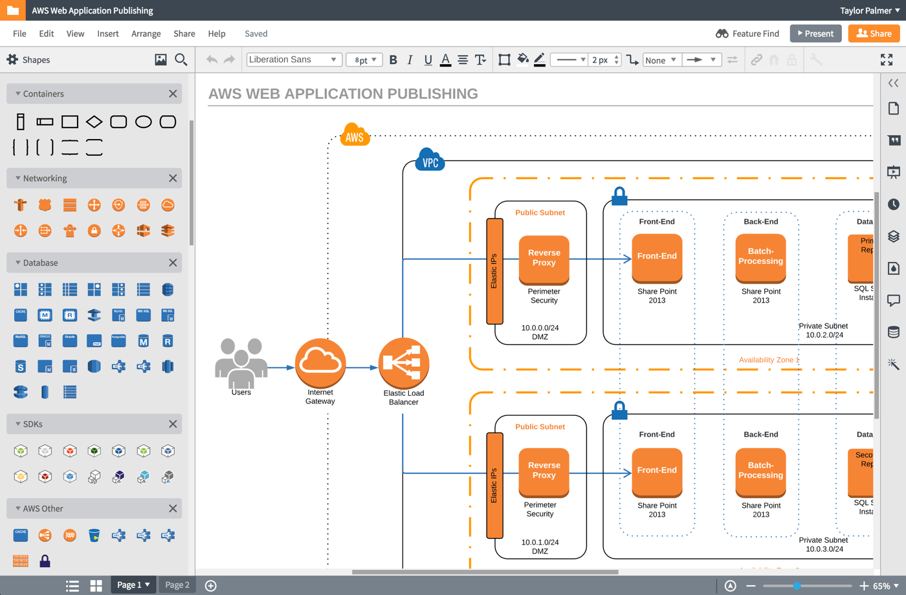
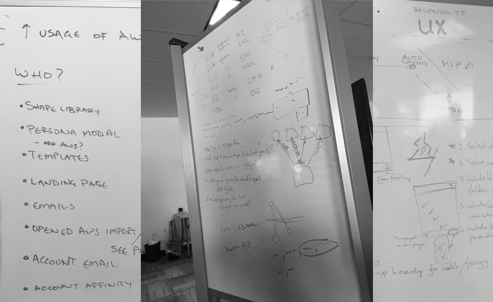
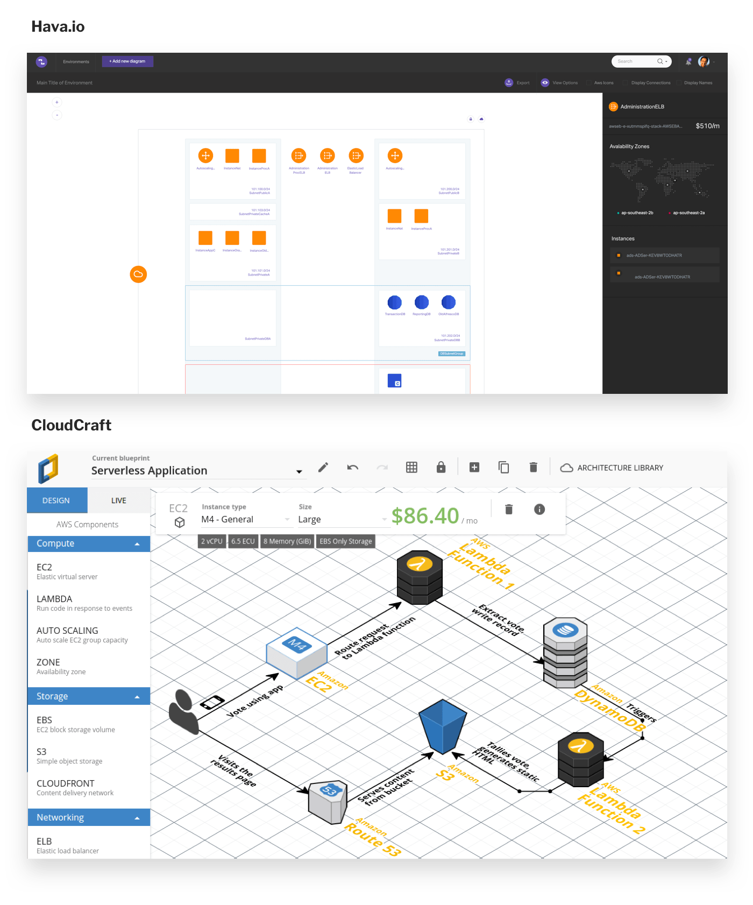
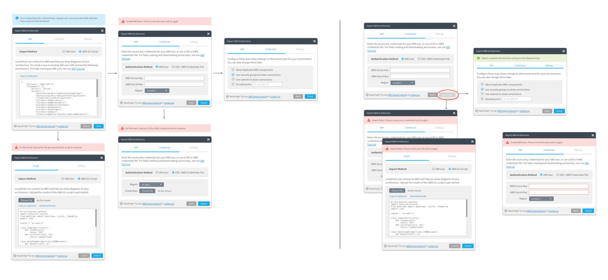
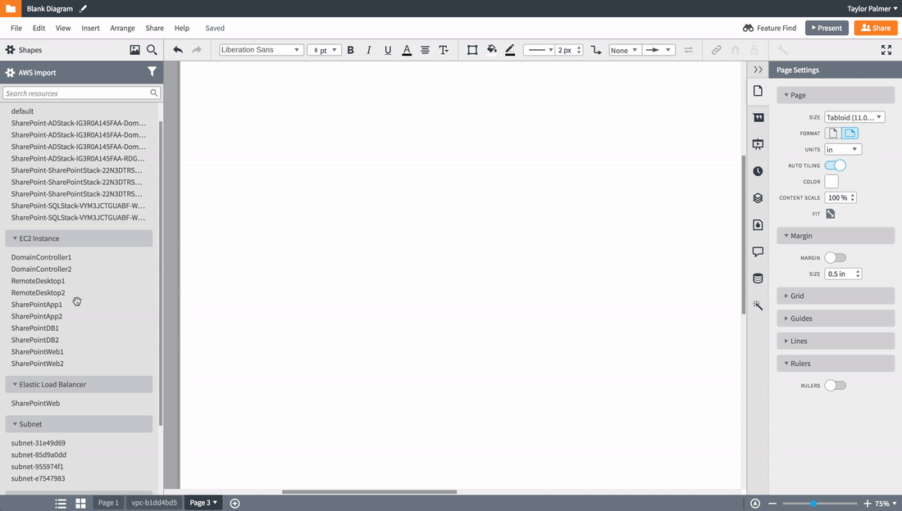
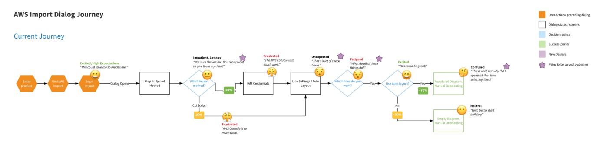
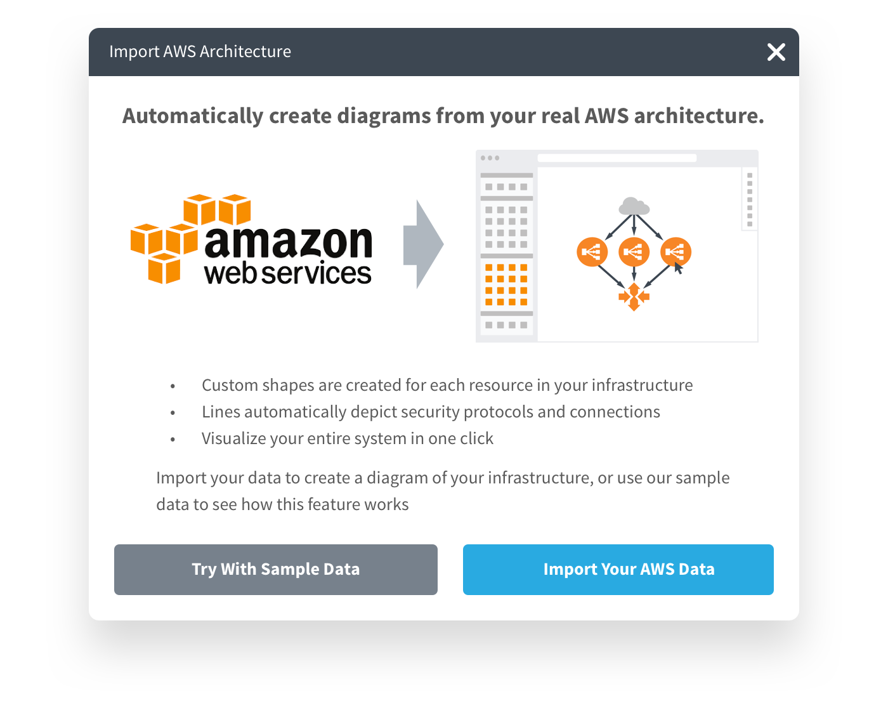
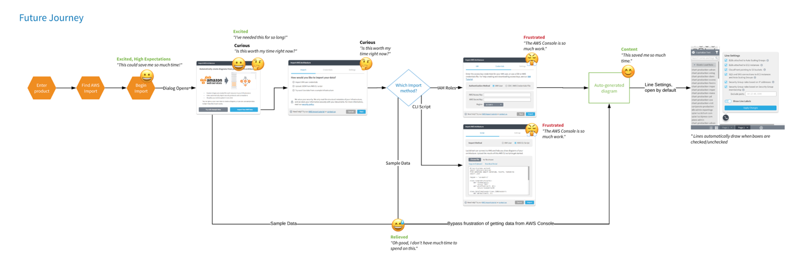
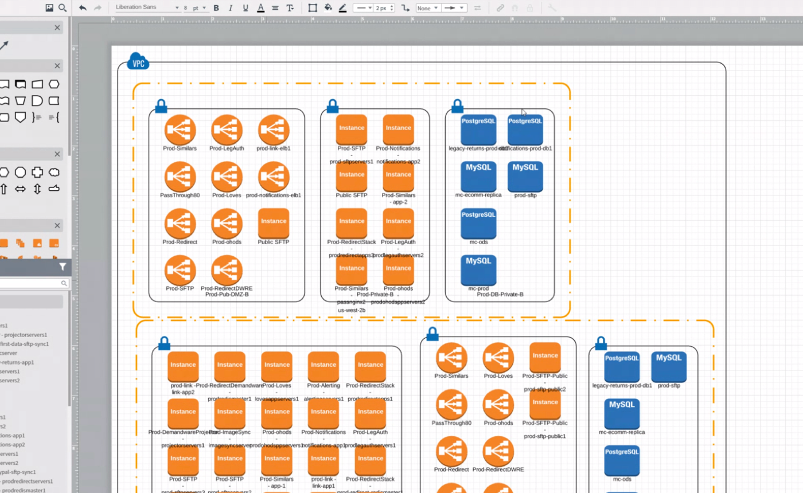
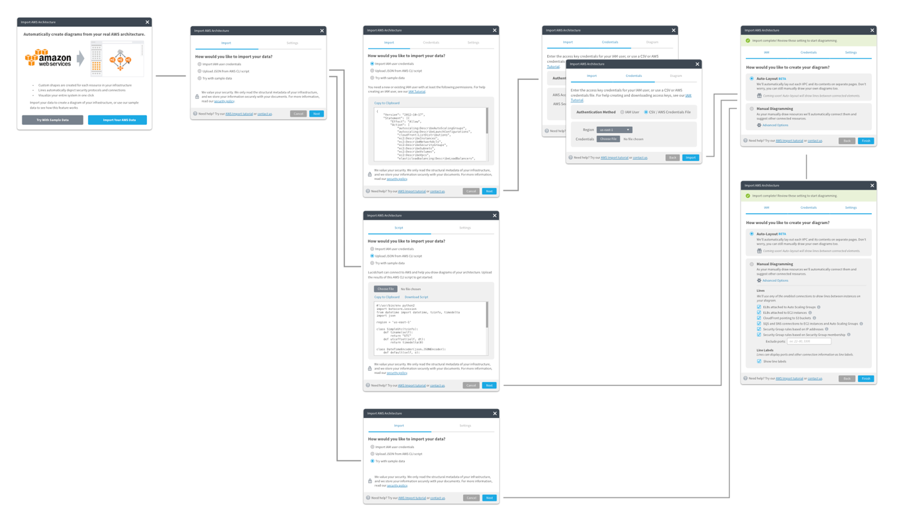

# AWS Import

## Overview

Over more than a year, I helped my team explore and design new and innovative ways to import an AWS infrastructure (explained below) and turn it into a real, living Lucidchart diagram.

## My Role & Team
I designed through multiple iterations of the Lucidchart AWS Import feature alongside a product manager, three engineers, and a QA specialist. I led user interviews, design reviews, and worked alongside engineers during implementation. 

My team made frequent presentations to leadership and other stakeholders about progress, possible pricing segments, and how other departments should pitch the feature. Many of these efforts were lead by the product manager.

*Please note that the orange and blue shapes in the following diagrams were not designed by me, but are the AWS standard for diagramming.*

## Timeline
The first iteration began in summer of 2016 with limited resources, and the much more robust second iteration took place during the better part of 2017.
 
## What is Amazon Web Services (AWS)?
AWS is a backend software service provided by Amazon to run anything from a standard server to authentication and notifications.

One of the more difficult aspects of this project was wrapping my head around AWS and its various components. I spent a lot of time at whiteboard with fellow engineers drawing sample diagrams and proposing fictional scenarios to understand the behavior of virtual and physical backend infrastructure.

I’m not an AWS expert by any stretch of the imagination, but I can talk my way around regions, VPCs, availability zones, subnets, ELBs, EC2s, and a whole slew of other acronyms.

## Background
What started as a quick hackathon project eventually gained the attention of Lucidchart leadership and received the resources it deserved. Lucidchart is known for generating diagrams from data (org charts, mind maps, entity relationship diagrams, etc) and and AWS import represented an opportunity to uniquely position ourselves in the diagramming space.

Diagrams are already part of the AWS ecosystem, and Amazon even provides guidelines for how the diagrams should look and how resources should be represented.

Our goal: Helps customers create compliant diagrams automatically.

## Discovery
### (Potential) Customer Interviews
I spoke to dozens of AWS users throughout the entirety of this project, both for discovery calls and usability tests. Some of these participants were long time Lucidchart users, others were evaluating our tool for potential future use. Each conversation provided unique insights into the world of a network engineer.

### Competitive Analysis
I audited multiple competitors with a product manager and an engineer, included Cloudcraft.io and Hava.io. Because this space is so fragmented, some potential customers even turned to Adobe Illustrator to create their diagrams. The analysis showed:
- Isometric layout isn’t useful (but looks pretty cool)
- Customers need to be able to move shapes after import (Hava.io is entirely locked down, can’t tell a story)
- Relationship lines could be shown dynamically (on-click like Have) or shown all the time

### Known Problems
The combined output of our competitive analysis and customer research proved a few initial hypotheses:
* Many customers have large, often unknown architectures (they may be a consultant, or it may be so large they don’t know everything that exists in the system)
* These diagrams are time consuming to make, but are necessary for compliance and communication (sometimes for legal reasons)
* These diagrams contains sensitive information, and there are trust issues handing that data to Lucidchart
* This feature would likely have a small user base with a high price tag (because only one or two people per company would need it)

### Divergent Thinking
Armed with our understanding of the industry and the needs of network engineers, we proposed three different solutions:
1. A manual build process based on “groups” (this was the original hackathon approach)
2. A node-by-node building experience based on security protocols
3. An automatically-generated diagram of all resources laid out like a map

## Define
### Constraints
Because of the constraints listed below, we settled on option 2: a node-by-node experience that would take far less time to build than option 3, and would still test the viability of this market.

### Requirements
Because AWS is very safeguarded within organizations, many teams have different ways of sharing these features. While some teams preferred to hand over a static snapshot through a JSON file, and others preferred a live connection through an actual API. We did our best to meet these various needs.

The product needed to:
- Support import through JSON as well as IAM roles (API)
- Generate shapes based on real, known resources
- Draw lines based on real, known connections
- Automatically use lines to connect shapes whose security rules allow traffic between them

## Develop
I like to solve as much of the design and flow at a whiteboard with my team before I ever jump into actual UI design. Engineers and product managers helped me understand all of the moving pieces necessary to perform a successful import via JSON or API, and I proposed fine-grained interactions on the Lucidchart canvas.

### The Import Process
When importing, a customer can choose their preferred import method, and provide us the necessary details for authentication. Then, they’re present with diagram-specific options that will change the way we draw lines and structure their diagram.

### The Diagramming Process
The foundation of the node-by-node solution automatically connects shapes based on known security protocols. It also suggests shapes to draw based on what we know is connected to the selected shape.

## Deliver
At Lucid, we use Zeplin to redline designs (and our nifty [Bill of Materials](/projects/lucid-design-system) for component deliver). I never spend too much time on handoff because by the team I’m giving designs to an engineer, we’ve talked through these problems dozens of times at a whiteboard, and I frequently check-in as things are being built.

## Outcomes
While we monitored this feature with analytics and event tracking, the sample size was too small to make any significant observations. Instead, we relied on qualitative interviews to inform our measurement of success.

We called customers and had them use the feature while they talked to us (or talk to us about their previous experience with the feature). The feedback was fairly unanimous:
* It’s faster than manually drawing a diagram
* But almost all customers expected an automatic diagram (Option 3 in our discovery phase)
* Some customers even thought the feature was broken
* Still very useful for specific use cases (like security and compliance diagrams)

While we had designed and built an incrementally useful feature, our constraints had stifled our ability to deliver real value. We petitioned leadership for more resources and more time to give this feature the chance it deserved.

## Round 2 — Discovery
My team went back to the drawing board to determine how we could feasibly build an automatically generated diagrams (termed “auto layout”) and meet our customer’s expectations. 

We relied on customer’s reactions to our first solution to fuel our decisions for this new solution.

Through the combination of analytics and interviews, I gained an understanding of the pain points in the interview process and constructed a journey map (using emojis to convert emotion) to drive my team to alter the import process.

View the full size user flow [here](/aws-import-user-flow.pdf).

## Round 2 — Define
### Requirements
Without getting to deep into the details of AWS, we knew we needed to:
* Continue addressing issues of security and trust
* Meet user expectation of an auto-generated diagram
* Write algorithms to lay shapes out intelligently in containers and grids
* Maintain the utility of our node-by-node experience for security and compliance diagrammers
* Make the import process simpler and easier

## Round 2 — Develop
### New Ideas—Sample Data
Because the sample size of this feature is so small, and the technical barrier is so high, the conversion funnel of our import process was very low. We decided to allow customers to try a sample import using a dummy AWS environment we provided. Without all the technical hassle, it showed customers how the features worked (and essentially functioned as a demo).

This new sample data options allowed a customer to completely bypass the technical rigor of this feature.

### Auto Layout
We spent hundreds of man hours at whiteboard trying to determine the best solution for an automatic diagram. It presented numerous problems:
* Sometimes, virtual resources could appear in multiple places at once, making it impossible to accurately diagram in two dimensions. After numerous explorations, we decided to simply duplicate the shape.
* Some organization unfortunately opened all security ports so that all resources could speak to each other. In a relatively small environment of only 300 shapes, that environment would generate 90,000 lines of communication. We opted to turn off lines, and allow them to be selectively activated based on the user’s needs.
* After several hundred shapes, browsers begin to slow to a crawl and (sometimes) crash. By splitting each VPC onto its own page, we avoided having to render to many shapes at once.

Here’s what an automatically laid out diagram looks like:

## Round 2 — Deliver
This process was much slower than the previous node-by-node experience because of its novel approach. It took several weeks to define and build this experience, and I spent a lot of time sitting with engineers at their desks while we tried different solutions for the auto-layout algorithm.

Again, I delivered a new import flow in Zeplin (now a little longer, featuring sample data and including options for auto layout).

## Outcomes
### Sample Data
We implement the Sample Data idea as an A/B test and saw phenomenal results in the conversion funnel. Without sample data, only 7.1% of users completed the flow. With sample data, we saw a 66% improvement to a 10.7% completion rate.

### Auto Layout
Customers were elated to see their diagrams laid out automatically. The told about the hundreds of man-hours we saved them, and all the great things they could do with their extra time now.

Unfortunately, the benefits stopped there. Once a customer began moving shapes, the diagram became very unwieldy. As luck would have, managing 300 procedurally generated shapes isn’t easy. Add 90,000 lines back into the mix and we were really in trouble.

We had a bigger problem: customers were beginning to encounter what we call “the legibility ceiling.” They wanted to visualize more information than is human-consumable in one sitting. Their desire to visualize this much information led us into a much more innovative and forward-thinking space: data visualization.

## Future Work
The AWS Import feature helped us encounter and understand the legibility ceiling. Using what we’ve learned here, my team has now pivoted to apply these insights to a new feature that is the opposite of AWS Import: organizational charts. This is a high-impact, highly visible feature with simple and predictable hierarchical structures.

We’re developing systems that will automatically rearrange shapes as they’re moved, show/hide irrelevant information, and connect to live sources that allow the diagram to evolve with data over time. As we master these elements, this thinking will come full-circle and make AWS Import the ultimate visualization tool for AWS.
