# Lucidchart Editor Redesign

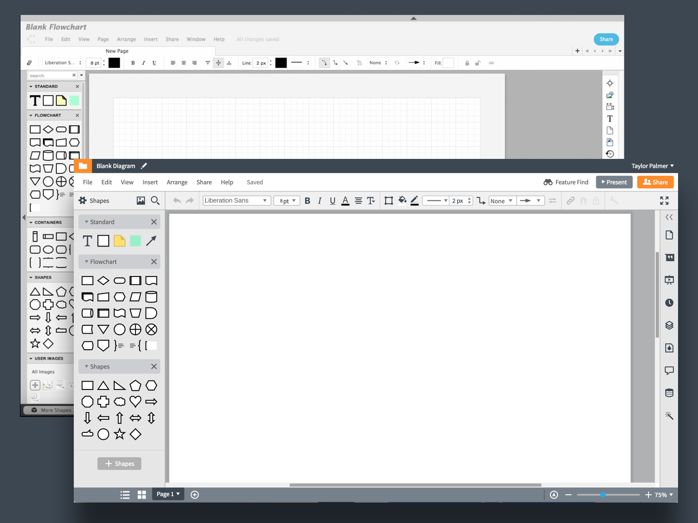

## Project Overview
I worked as lead designer to redesign Lucid’s flagship product, [Lucidchart](https://lucidchart.com), while the engineering team rebuilt it from the ground up with a new technology base. The project took longer than expected to exit the Beta phase before eventually winning a 50/50 A/B test.

## Timeline
In late 2015, Lucid expressed interest in redesigning their flagship product, Lucidchart. 

### 1. Product Audit, User Interviews, and Prototyping (Fall 2015)
Analysis of existing features and their usage, In-depth customer interviews with about 30 existing customers using an HTML/CSS/JS prototype of proposed new designs.

### 2. Alpha Release (Spring 2016)
A limited version of the new design with some missing features was made available to a small group of trusted testers for initial feedback.

### 3. Beta Release (Summer 2016)
An opt-in beta allowed customers to jump in and out of the new experience until they felt comfortable staying in the new experience (and that all of the features they needed were available).

### 4. A/B Testing (Summer 2016 – Summer 2017)
A/B tests monitored the health of the new design with new customers.

### 5. Official Release
A final A/B test determined the new design the winner, and it is now the official and only Lucidchart experience.

## My Role
I worked on a team of 4 during initial research (3 designer, 1 product manager), then was the sole lead designer during the alpha and beta phases. Half way through beta, a new designer was brought onto the team (who I managed) that worked on the project until final release.

## Goals
While some of these goals were both spoken and unspoken, these guiding principles stayed with this project until the end:
- Remove as much as possible from the old, bloated product and only bring it back if absolutely necessary
- Update the product aesthetically to create a professional, trustworthy enterprise appearance
- Create a sustainable and scalable component system to be reused in future product development

## 1. Product Audit, User Interviews, and Prototyping
I worked with two other designers and a product manager during the discovery and research process. We began understanding existing features by analyzing performance metrics.

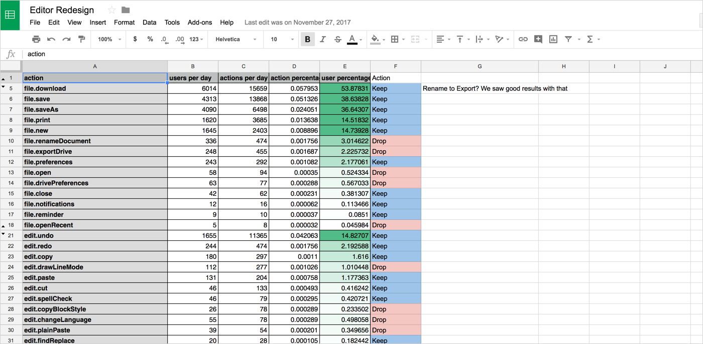

We simplified the Lucidchart interface into three main segmentations that were easily recognized and articulated by our customers:

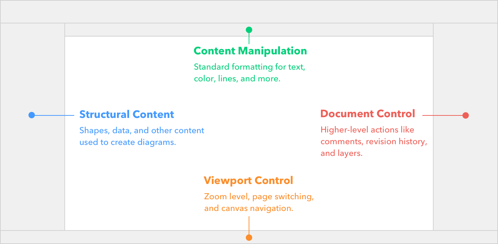

Customer interviews helped us solidify the core problems that our existing customers were facing. They also took us through several iterations of key components like the option bar. Much time was spent the painstakingly find the right icons and organization for to meet user mental models. I would argue it’s still not perfect, but it’s getting there.

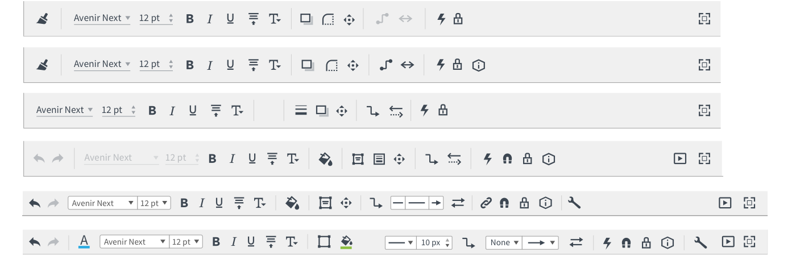

We branched our various redesign ideas into three main directions and designed multiple prototypes centered around those directions. We would run various customers through only one experience and compare the feedback, or if a customer brought up a specific problem we might ask them to try another prototype to see if it better solved their problem.

Prototypes were originally built as messy conglomerates of code in Codepen, and gradually evolved to use a cleaner in-house component system based on Angular 1. These robust experiences included the ability to drag out shapes, change colors, open and close menus, and use real text inputs. The perspective gained from these prototypes experiences was invaluable. 

(You can try an older version of the prototype [here](https://lucidsoftware.github.io/particle/latest-prototype/chart-editor/index.html)—I've since switched to Framer.)

Because we were testing with several users across multiple prototypes, we grouped feedback into themes and color coded them according to their severity and positivity.

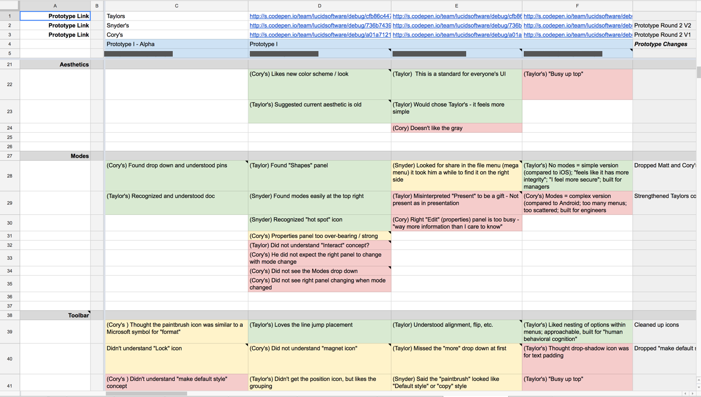

### ⚠️ A Lesson Learned
While these customer interviews were incredibly insightful and useful, they were narrow-minded. They focused on some of our strongest and most vocal users who advocated powerful, advanced features. We missed the perspective of quieter, newer customers who use the product less and need a more approachable interface. This would come back to harm us in the Beta stage of the project.

## 2. Alpha Release
While the design team researched and iterated, the engineering team was busy building the foundations of the new redesign. As our ideas solidified, we passed along basic concepts and general directions. After a few months, a heavily pared-down and feature incomplete version of Lucidchart was unveiled for specific, targeted customers.

This protected environment allowed certain customers to try the young, volatile product without the threat of losing important work and information. They were encouraged the share their raw and honest feedback. One of the most significant changes, driven by this feedback, was:

### Page Creation
We changed page creation from tab at the top of the screen to a draw of tiled previews that slid down from the top of the screen. This is a much slower identification and navigation process than tabs, but is much better for sorting through large numbers (100+) of pages. Unfortunately, less than 2% of our customers ever reach this number of pages, and we were appealing to the minority. 

I designed and proposed a new, smarter way of managing tabs while still maintaining the ability to view the tiled previews. Through an interactive prototype, testers were able to actually create, rename, and sort pages to organize them like they would in the real product. Some of the improvement included:
* Renaming occurred inline by double clicking, rather than in a modal
* The tiled previews were still accessible through an icon
* When the tabs exceeded the visible space, they could be scrolled with the mouse or navigated with arrows
* Tabs automatically scrolled into a visible position when selected

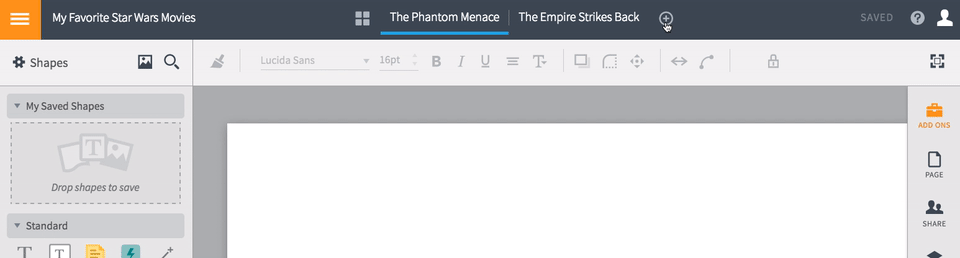

I sent the prototype to the Alpha testers through a Google Form.  The results of the survey indicated that this new approach was a huge success, and this design would remain (but be moved to the bottom of the screen) throughout the launch.

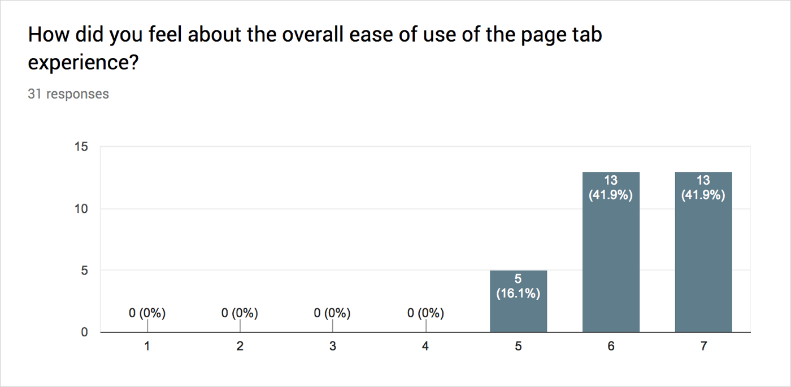

## 3. Beta Release
After more feature development, Lucidchart became available as an opt-in Beta for general use. The number of testers quickly increased from a few hundred to several thousand, and the design was pushed to its limits.

I collaborated with my scrum team to develop a quick way to monitor tester feedback in this environment. It worked something like the image below. Whenever a user exited the Beta mode, we asked them why they were leaving and to categorize the reason they were switching back. This feedback was managed through Zendesk, but was alternatively pumped into a Slack channel where any could read the messages in real time.

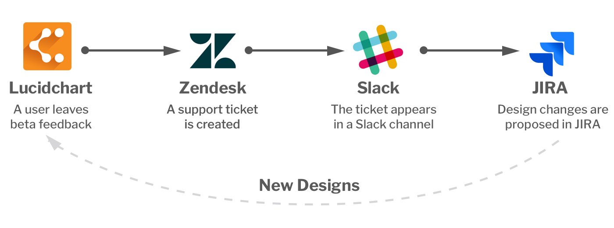

We flagged the messages with emojis as they came through ( ✅ meant someone had logged it on our feature prioritization spreadsheet, ❓meant the person reading didn’t know what the tester was talking about and needed help, and various other emoji were used to denote certain features, like a page 📄 ). No, this wasn’t the most genius or efficient system, but it was live customer feedback! It was absolutely vital to improving our beta experience.

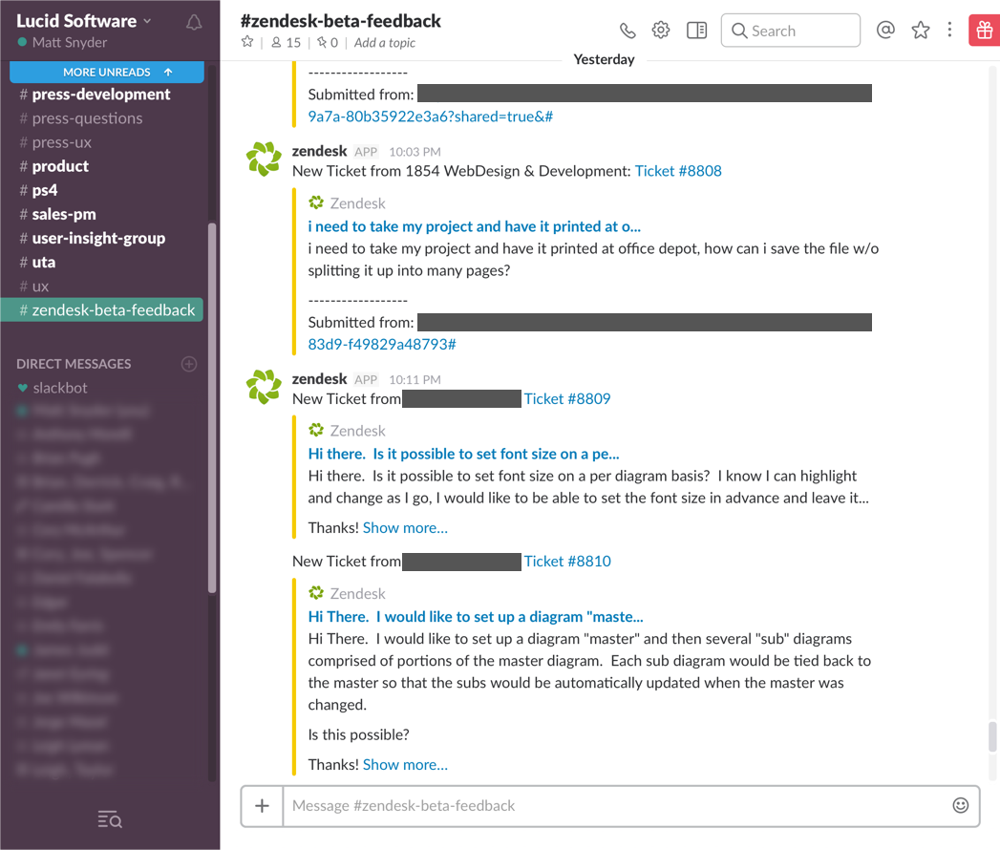

Some of the beta improvement we made included:

### Removing the Hamburger Menu
In an attempt to streamline and simplify the interface, we moved all of the existing File menu functions into a side menu that was accessible through a hamburger icon. While trendy and elegant, all metrics hidden behind this menu suffered heavily. One principle stayed constant throughout this process: the more visible a feature is, the more it will be used.

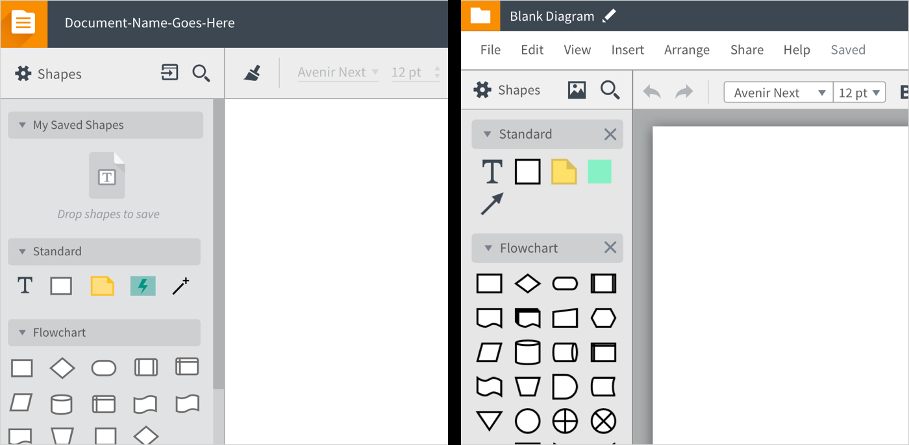

### Moving the Share Menu
I had great hopes and dreams for a sharing function (think Google Docs) that lived in a sidebar of the interface and felt integrated rather than in a modal. At the end of the day, analytics showed that sharing was underperforming and had to be promoted like it was in the old interface.

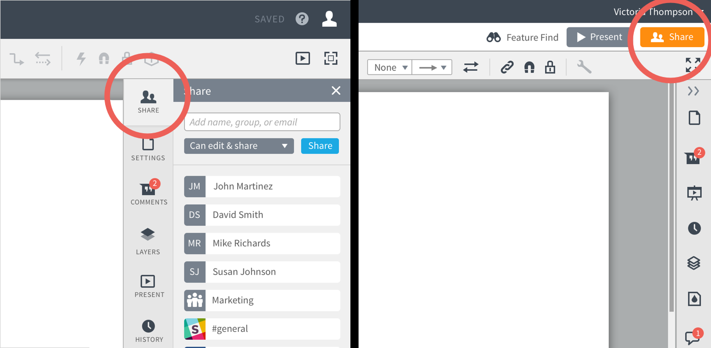

### Giving Back Screen Real Estate
My new design was modern, consistent, and professional. It was also visually larger than its predecessor, and customers knew it. Some of the strongest feedback we received was to put the interface on a diet. We shaved off pixels from every menu and toolbar we could.

Sometimes, customer interpreted toolbars as being larger than the old design when, in fact, they were the same size (there’s a lesson here about perception and communication). After a few iterations, these problems were solved and customers felt comfortable again.

### Color Picker Unification
Alpha testers responded very positively to a new approach to a color picker: fill, border, and text all wrapped into one simple callout. While it had a slight learning curve (because it was different from other content editing interfaces) we felt that the efficiency of it outweighed the learning curve.

Beta testers felt otherwise. Breaking this UI back into three separate elements saw an increase in core tasks (creating and formatting shapes).

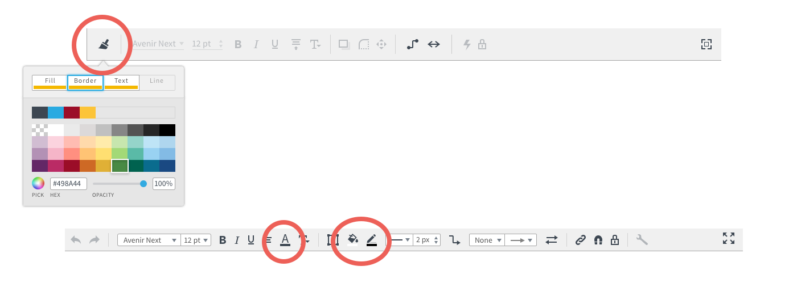

### Closing the Right Dock
Despite reusing a familiar pattern (an “x” in the top right corner) some customers struggled to close the Lucidchart right dock. This contributed to the pains customers felt about screen real estate because their screen felt smaller when they couldn’t close this panel.

Instead of an “x”, we changed the design to two small arrows in line with the other icons. This variation saw much better results.

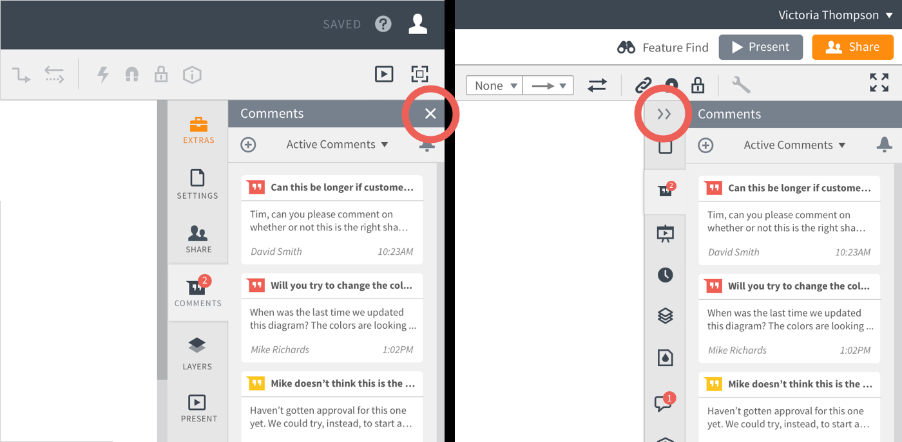

### Undoing the Undo Button
For this feature some might ask, "has science gone too far?" We audaciously removed the "undo" button in an attempt to see how far we could push our customers to rely on hotkeys and other traditional paradigms. We quickly learned that not all customers are made equally, and _many_ of our customers refuse to use keyboard shortcuts.

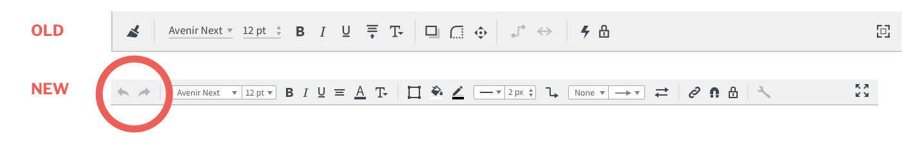

## 4. A/B Testing
The Product team began running small A/B tests from the moment the Beta phase began (despite being feature incomplete). The new beta experience would be automatically enabled for a small percentage of new customers to compare their behavior with new customers using the old experience. The most important metrics monitored were:
* First payments for the product
* Sharing documents
* Returning documents
* New user retention rate (NURR)

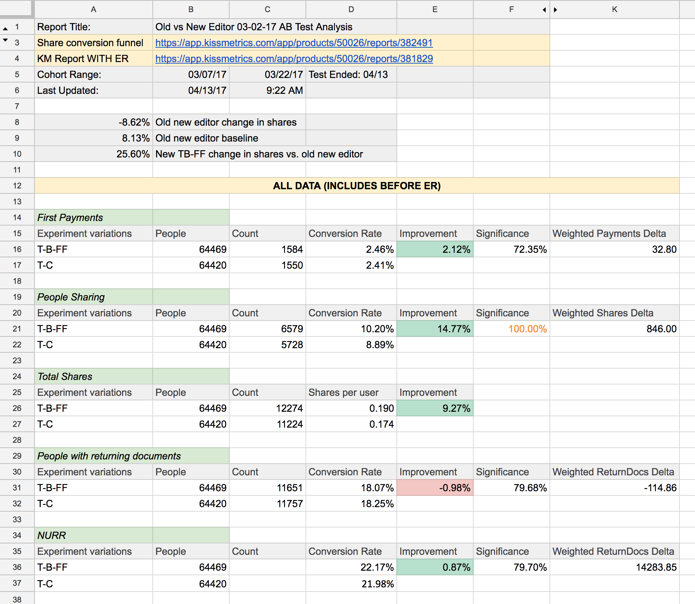

Even though the first several A/B tests fell short, the metrics began to even out as the product approached feature parity. Unfortunately, we had made a big mistake as a product team that would cost us almost a year of development time.

### ⚠️ One Big Mistake
Early in the research phase design, product, and engineering met to discuss the phases and development method for the redesign. Two approaches were proposed:
1. Build the new design holistically from the ground up using new technology, and test it against the old design.
2. Build pieces of a new design one-by-one, and test them as they were integrated into the product.

The team ultimately rallied around option 1. In hindsight, option 2 was the obvious right answer. By performing a wholesale swap of the entire interface _and_ the underlying technology, the team was powerless to diagnose problems or move metrics once we reached feature parity. 

For example: when alpha testing began, the new experience took an average of 21 second to load while the old experience took 13 seconds. Engineering problems made it much more difficult to decipher challenges in the design.

The Lucidchart editor is a single-page app. The entire experience happen in one interface. Any drop in metrics could have been due to technology bugs or bad design, or a combination of the two. Diagnosis was difficult, and winning an A/B was even more difficult.

### Moving Into Management
Halfway during this A/B testing process, I moved to a different team and started managing the designer who took my place in the redesign effort. I did my best to transfer my skills and understanding to her while she fought tooth and nail to help the new experience win.

## 5. Official Release
After nearly a year of struggling to win A/B tests, the team found a winning combination and implemented one final test of the old design against the new design. The results were positive, and the team officially moved the new experience to be the only experience.

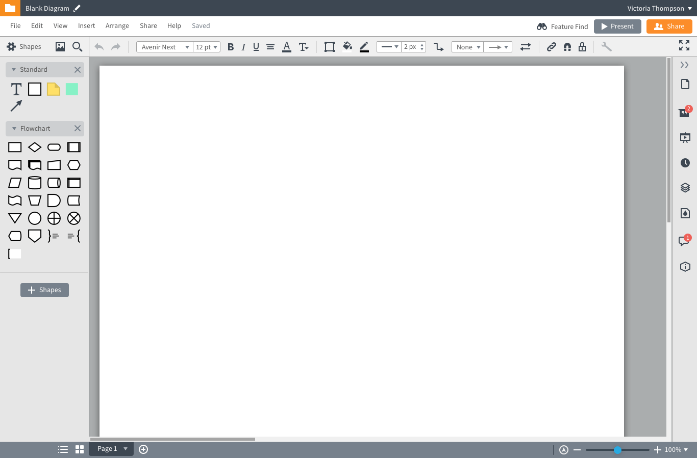

## Retrospective
If I had to do it all over again, I would:
* Be more careful about who I interviewed, a construct a better sample of our customer base
* Rebuild the old experience using new UI, but without moving anything (to test the success of new icons, aesthetics)
* Swap out small parts of the design one at a time, instead of a wholesale swap
* Be more thoughtful about visual aesthetics before development began (the component system came to be without any grid of typographic system)
* Despite Lucidchart being somewhat a swiss army knife (with infinite use cases), I would have tried harder to tie down a prioritize to strongest use cases and champion their success